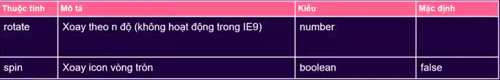
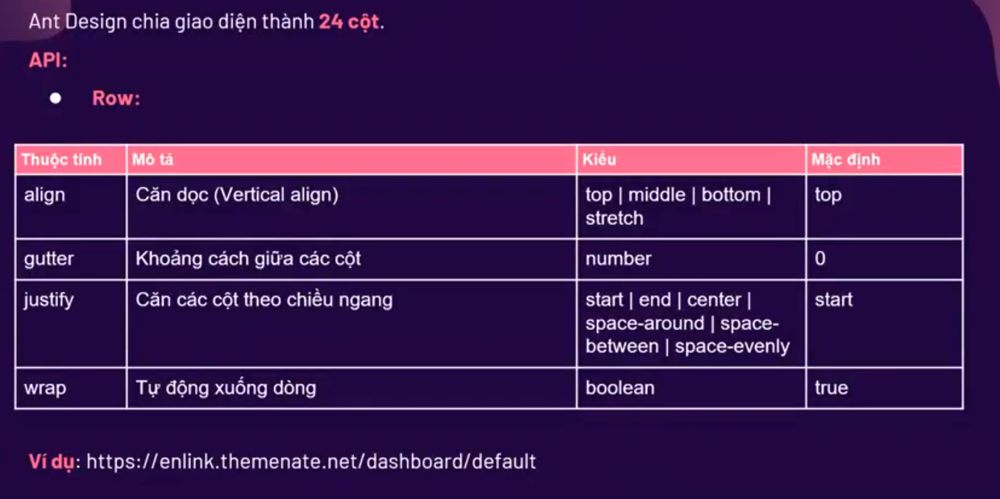
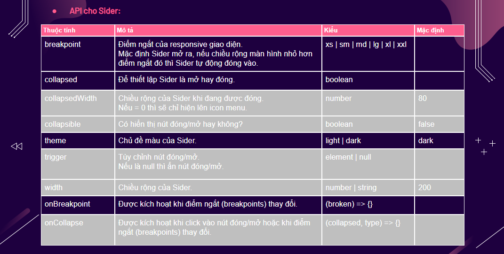
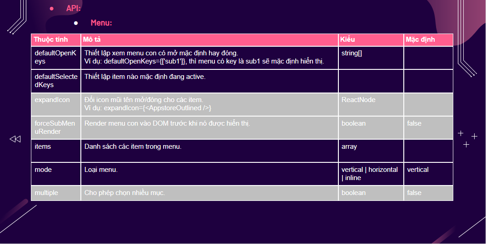
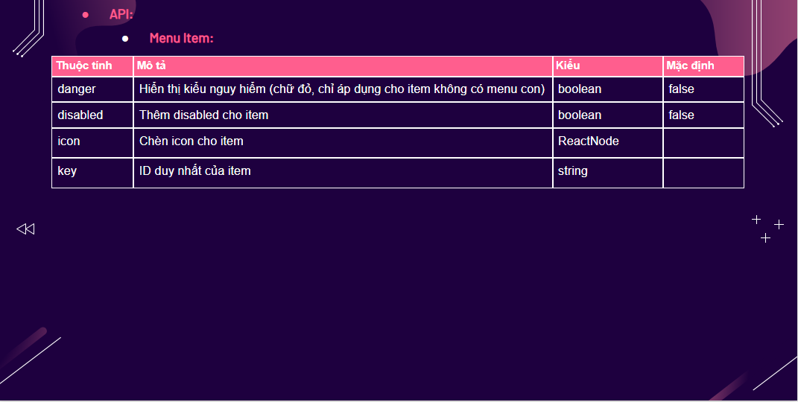

### Ant Design

# `Buổi 01:`

## **01: `Giới thiệu và cài đặt`**

### Giới thiệu:

- <i>Ant Design là một <b> `thư viện` </b> để xây dựng UI</i>
- <i>Ant Design cung cấp nhiều <b>`Components`</b> để xây dựng website chất lượng cao và dễ bảo trì </i>
- <i>Được phát triển bởi <b>`Alibaba`</b></i>
- <i></i>

### Cài đặt:

- <i>Link website: <a><b>`https://ant.design/`</b></a></i>
- <i>Link npm: <a><b>`https://www.npmjs.com/search?q=antd`</b></a></i>
- <i>Lệnh cài đặt: <b>`npm i antd`</b> </i>

## **02: Component: `Button`**

## **03: Component: `Icon`**

## **04: Component: `Typography`**

## **05: Component: `Grid`**

## **06: Component: `Layout`**

- <i>Dùng để xử lý bố cục tổng thê của một trang web</i>
- <i>Các <b>`Component`</b> của Layout:</i>
- <b>`Layout:`</b>
- <i>Bao boc toàn bộ bố cục (tương tự thẻ `section` trong `HTML`) </i>
- <i>Bên trong có thể chứa các `component`: `Header, Sider, Content, Footer hoặc lồng một Layout khác`</i>
- <b>`Header:`</b>
- <i>Là header của trang (tương tự thẻ `header`)</i>
- <b>`Sider:`</b>
- 
- <i>Là menu bên trái của trang (tương tự thẻ `aside`)</i>
- <b>`Content:`</b>
- <i>Chứa toàn bộ nội dung của trang (tương tự thẻ `main`)</i>
- <b>`Footer:`</b>
- <i>Là chân trang (tương tư thẻ `footer`)</i>

## **07: Component: `Dropdown`**

- 

## **08: Component: `Menu`**

- 
- 
- 

## **Bài tập**

## <b>Link demo: <a>`https://enlink.themenate.net/dashboard/default`</a></b>

# `Buổi 02:`
